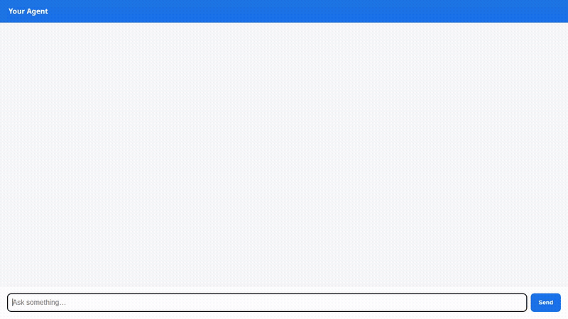

# LifeOS Concierge

LifeOS Concierge is an agentic personal life administration and maintenance assistant built with Google's Agent Development Kit (ADK 1.1.0). It helps users track recurring subscriptions, calculate monthly expenses, search grounded herbal/maintenance guides, schedule tasks around public holidays, execute Python calculations in an isolated sandbox, generate visual assets, and persist user preferences across sessions.



---

## Key Implemented Features

### 1. Subscription & Maintenance Management (Google Cloud Firestore)
- **Database Integration**: Reads, stores, and updates recurring subscriptions and household maintenance tasks in Cloud Firestore.
- **Custom Functions**:
  - `list_subscriptions`: Filter items by category or list all stored items.
  - `add_subscription`: Save new items with cost, frequency, due date, and notes.
  - `update_subscription_status`: Update item statuses (`active`, `paused`, `cancelled`, `completed`).
  - `calculate_subscription_metrics`: Aggregate total monthly recurring costs, annual projections, active item count, and category breakdown.

### 2. Cross-Session Long-Term Memory (Vertex AI Memory Bank)
- **Memory Persistence**: Integrates `PreloadMemoryTool` and `add_session_to_memory` callback to automatically extract and remember user preferences, vehicle info, and budget constraints across sessions.

### 3. Grounded Retrieval / RAG (Vertex AI RAG Engine)
- **Knowledge Retrieval**: Searches a serverless Vertex AI RAG Engine corpus (*The Complete Herbal*) via `consult_life_admin_herbal_guide` to provide grounded advice for natural remedies, cleaning guides, and traditional life maintenance.

### 4. Image Generation & Cloud Storage (Gemini + GCS)
- **Visual Asset Generation**: Generates custom visual status badges, task diagrams, and icons using `gemini-3.1-flash-lite-image` in the global region via `generate_life_admin_item_image`.
- **Dual Persistence**: Saves generated images to `tool_context.save_artifact` for playground inspection and uploads bytes directly to a public Google Cloud Storage bucket (`lifeos-concierge-assets-*`), returning public HTTPS URLs.

### 5. Sandboxed Python Code Execution (Agent Platform Sandbox)
- **Safe Code Execution**: Configured with `AgentEngineSandboxCodeExecutor` bound to an Agent Engine resource, enabling the agent to write and execute Python code in an isolated sandbox for math calculations and data processing.

### 6. External Public API Integration (Nager.Date)
- **Holiday Lookup**: Calls the public Nager.Date API (`get_upcoming_holidays`) to retrieve official public holidays for scheduling life admin tasks without requiring API keys.

### 7. Rich Display UI (A2UI v0.8)
- **A2UI Schema Manager**: Uses `A2uiSchemaManager` (version 0.8) with the Basic Catalog to format responses into rich visual UI cards (`Card`, `Column`, `Row`, `Text`, `Image`).
- **Callback Wiring**: Wired via `after_model_callback=a2ui_callback` to emit structured A2UI cards.

### 8. Frontend Chat Proxy & Cloud Run Deployment
- **FastAPI Proxy**: Minimal FastAPI proxy (`frontend/main.py`) communicating with the deployed agent using the Agent to Agent (A2A) protocol (`a2a-sdk`).
- **Chat UI**: Built-in HTML/CSS/JS frontend rendering plain text replies and native A2UI cards.
- **Cloud Run Ready**: Containerized with `Dockerfile` and deployed to Google Cloud Run with `roles/aiplatform.user` service account access.

---

## Planned / Not Yet Implemented
- **Automated Push Notifications**: Proactive email or push alerts before subscription renewal dates (planned future enhancement).
- **Bank Account Sync**: Direct financial institution sync for automated expense ingestion (planned future enhancement).

---

## Local Setup & Run Instructions

### Prerequisites
- Python 3.11+ or `uv` package manager
- Google Cloud SDK (`gcloud`) authenticated via Application Default Credentials (`gcloud auth application-default login`)
- GCP Project with Firestore, Vertex AI, and Cloud Storage APIs enabled

### 1. Installation
Clone the repository and install project dependencies:
```bash
cd lifeos-concierge
uv sync
```

### 2. Run Agent Development Playground
To run the ADK web playground locally:
```bash
uv run adk web
```
The ADK web interface will start on port `8080`.

### 3. Run Frontend Chat Proxy Locally
To run the FastAPI proxy and standalone chat UI locally:
```bash
cd frontend
pip install -r requirements.txt
export AGENT_ENGINE_RESOURCE_NAME="projects/<PROJECT_ID>/locations/<REGION>/reasoningEngines/<ENGINE_ID>"
export AGENT_DIRECTORY="app"
python main.py
```
Open a browser to port `8080` to interact with the chat interface.

### 4. Deploy Agent & Frontend to Google Cloud
Deploy the agent runtime:
```bash
agents-cli deploy
```

Deploy the frontend proxy to Cloud Run:
```bash
cd frontend
gcloud run deploy lifeos-concierge-frontend \
  --source . \
  --region us-east1 \
  --allow-unauthenticated \
  --set-env-vars AGENT_ENGINE_RESOURCE_NAME="<YOUR_RESOURCE_NAME>",AGENT_DIRECTORY="app"
```

Grant Cloud Run service account access to Agent Platform:
```bash
gcloud projects add-iam-policy-binding <PROJECT_ID> \
  --member="serviceAccount:<COMPUTE_SERVICE_ACCOUNT>" \
  --role="roles/aiplatform.user"
```
